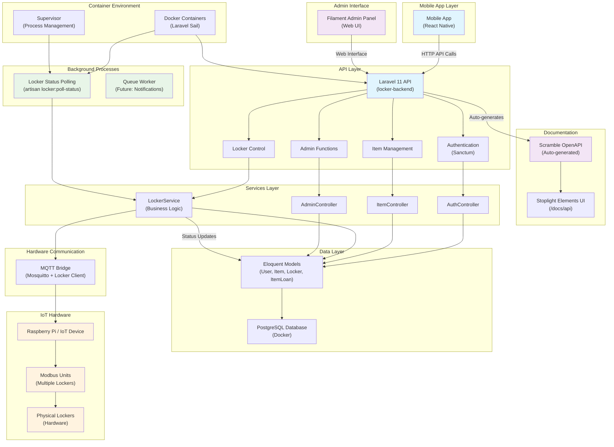

# Open-Locker System Architecture

## Overview

Das Open-Locker System ist ein IoT-basiertes Schließfachsystem, das aus mehreren
Komponenten besteht:

- **Backend**: Laravel 11 API mit Filament Admin-Panel
- **Frontend**: React Native Mobile App für Endnutzer (rewrite / target app)
- **Hardware**: Raspberry Pi mit Modbus-Kommunikation zu physischen
  Schließfächern
- **Documentation**: Automatische OpenAPI-Dokumentation mit Scramble

## Architecture Diagram

## Component Details

### Core Components

#### Laravel Backend (locker-backend/)

- **Framework**: Laravel 11 with PHP 8.4+
- **Authentication**: Laravel Sanctum für API-Token-basierte Authentifizierung
- **Database**: PostgreSQL (Docker) als Standard, SQLite für Tests/Kleininstallationen
- **Admin Panel**: Filament 3.x für administrative Aufgaben

#### Mobile App

- **Platform**: React Native (cross-platform)
- **Features (v1 focus)**: authentication, show accessible compartments, open/close + realtime feedback

#### Hardware Integration

- **Modbus Communication**: Über einen dedizierten Locker Client, der per Modbus mit der Hardware spricht
- **Protocols**: Sowohl Modbus TCP als auch RTU unterstützt
- **Hardware**: Raspberry Pi als IoT Gateway zu physischen Schließfächern

### Data Models

#### Core Entities

- **User**: Benutzer mit Admin-Rollen
- **Item**: Ausleihbare Gegenstände mit Bildern
- **Locker**: Physische Schließfächer mit Modbus-Adressen
- **ItemLoan**: Ausleihvorgänge mit Zeitstempel

#### Key Relationships

- Item ↔ Locker (1:1)
- User ↔ ItemLoan (1:N)
- Item ↔ ItemLoan (1:N)

### API Structure

#### Public Endpoints

- `GET /api/identify` - Service-Identifikation
- `POST /api/login` - Benutzeranmeldung
- `POST /api/register` - Benutzerregistrierung (Admin-only)

#### Authenticated Endpoints

- `GET /api/items` - Alle verfügbaren Items
- `POST /api/items/{item}/borrow` - Item ausleihen
- `POST /api/items/{item}/return` - Item zurückgeben
- `GET /api/items/loan-history` - Persönliche Ausleihhistorie

#### Admin Endpoints

- `GET /api/admin/users` - Benutzerverwaltung
- `GET /api/admin/lockers` - Schließfach-Übersicht
- `POST /api/admin/lockers/{locker}/open` - Manuelles Öffnen

### Background Services

#### Locker Status Polling

- **Command**: `artisan locker:poll-status`
- **Function**: Kontinuierliche Überwachung aller Schließfach-Status
- **Deployment**: Läuft als separater Docker-Container
- **Frequency**: 0.5 Sekunden Polling-Intervall

#### Queue System

- **Setup**: Laravel Queue für asynchrone Verarbeitung
- **Future**: E-Mail-Benachrichtigungen, Erinnerungen

### Development & Deployment

#### Development Environment

- **Laravel Sail**: Docker-basierte Entwicklungsumgebung
- **Services**: PHP 8.4, SQLite, Mailpit, Node.js
- **Commands**: `sail artisan`, `sail composer`, `sail npm`

#### Production Deployment

- **Container**: Multi-stage Docker-Build
- **Base**: ServerSideUp PHP-Images
- **Features**: FFI-Support, Modbus-Library, Supervisor

## Security Considerations

### API Security

- **Authentication**: Sanctum Token-based
- **Authorization**: Policy-basierte Zugriffskontrolle
- **Admin Protection**: AdminMiddleware für administrative Endpunkte

### Hardware Security

- **Network**: Modbus-Kommunikation über isoliertes Netzwerk
- **Access Control**: Locked-down Raspberry Pi mit minimalen Services
- **Monitoring**: Status-Polling für Anomalieerkennung

## Monitoring & Maintenance

### Health Checks

- **Laravel**: Built-in Health-Check-Endpoint (`/up`)
- **Hardware**: Modbus-Connection-Status über LockerService
- **Database**: Connection-Monitoring über Eloquent

### Logging

- **Application**: Laravel Log-Channels (single, daily, slack)
- **Hardware**: Modbus-Communication-Logs
- **Deployment**: Docker-Container-Logs

### Metrics

- **API**: Request/Response-Tracking
- **Hardware**: Locker-Status-Changes
- **Users**: Loan-Statistics über Admin-Panel
