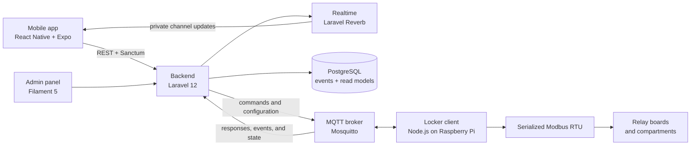

# Open-Locker System Architecture

## System boundaries

Open-Locker separates internet-facing application concerns from on-site
hardware access:

```mermaid
flowchart LR
    Mobile["Mobile app<br/>React Native + Expo"]
    Admin["Admin panel<br/>Filament 5"]
    API["Backend<br/>Laravel 12"]
    Reverb["Realtime<br/>Laravel Reverb"]
    DB[("PostgreSQL<br/>events + read models")]
    Broker["MQTT broker<br/>Mosquitto"]
    Client["Locker client<br/>Node.js on Raspberry Pi"]
    Modbus["Serialized Modbus RTU"]
    Hardware["Relay boards<br/>and compartments"]

    Mobile -->|REST + Sanctum| API
    Admin --> API
    API --> DB
    API -->|commands and configuration| Broker
    Broker -->|responses, events, and state| API
    Broker <--> Client
    API --> Reverb
    Reverb -->|private channel updates| Mobile
    Client --> Modbus --> Hardware
```

The backend has no Modbus dependency and does not connect to relay boards. Its
hardware boundary is MQTT. `locker-client` owns serial communication, command
deduplication, local runtime configuration, and hardware state reporting.

## Components

- **`locker-backend/`** — Laravel 12 REST API, Sanctum authentication,
  Filament 5 administration, event-sourced domain workflows, MQTT integration,
  Reverb broadcasting, and PostgreSQL persistence.
- **`mobile-app/`** — React Native and Expo client. Its RTK Query API bindings
  are generated from the backend's live OpenAPI document.
- **`locker-client/`** — TypeScript service deployed on a Raspberry Pi. It
  provisions over MQTT and translates validated commands into serialized
  Modbus RTU operations. It also provides a hardware-free fleet simulator.
- **Mosquitto** — MQTT broker with HTTP authentication and authorization
  delegated to backend endpoints.
- **`website/`** — Astro site for the public project presence and published
  documentation.
- **`hardware/`** — KiCad designs and physical build references.

Deployment and setup belong in [the installation guide](Installation.md).
Operational details for the on-site bridge belong in the
[locker-client documentation](../locker-client/README.md).

## Backend domain and persistence

The current user-facing domain is based on locker banks and compartments, not
loans:

- A **locker bank** represents one provisioned on-site controller.
- A **compartment** has a physical mapping, observed door state, and a
  user-editable content note.
- **Direct compartment access** and **group compartment access** determine who
  may see and open compartments.
- **Groups** collect users and reusable access assignments.
- **Open requests** track authorization, command delivery, acknowledgement, and
  physical door outcomes.

State-changing workflows use `spatie/laravel-event-sourcing`. Aggregates record
domain events; projectors update PostgreSQL read models; reactors perform side
effects such as publishing MQTT commands or broadcasting client updates. Code
that changes domain state should use the aggregate/event path instead of
directly mutating a read model.

## Communication paths

### App to backend

REST handles authentication, accessible-compartment queries, content-note
updates, and open requests. The current mobile app applies Reverb door-state
and content-note updates to its cache, then refetches accessible compartments
after a disconnect or foreground transition. The backend also provides
open-progress events and a polling endpoint, but the current app does not
consume them.

The detailed client flow and channel contract live in
[the app communication guide](app_communication.md). Scramble generates the
OpenAPI document live from the backend at `/docs/api.json`; no exported
`api.json` is committed as the canonical contract.

### Backend to locker client

The backend publishes typed commands and configuration over MQTT. The locker
client publishes command responses, spontaneous device events, heartbeats,
connection state, and retained compartment snapshots. Mosquitto asks the
backend to authenticate clients and evaluate topic ACLs.

The canonical topics, message schemas, and operation directions live in
[the AsyncAPI MQTT contract](asyncapi/mqtt.yaml). Do not duplicate that contract
in general architecture documentation.

### Locker client to hardware

The locker client is the only component that speaks Modbus. It serializes
Modbus RTU access to Waveshare relay boards and uses hardware-timed relay pulses
for safe compartment opening. Hardware observations return through MQTT rather
than through backend-side polling.

## Sources of truth

- [Backend component documentation](../locker-backend/README.md)
- [Locker client component documentation](../locker-client/README.md)
- [Installation and deployment](Installation.md)
- [REST and realtime app communication](app_communication.md)
- [MQTT AsyncAPI contract](asyncapi/mqtt.yaml)
- [Architecture decision records](adr/)
