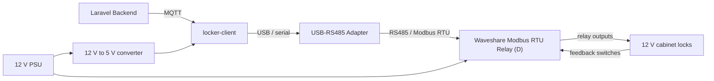
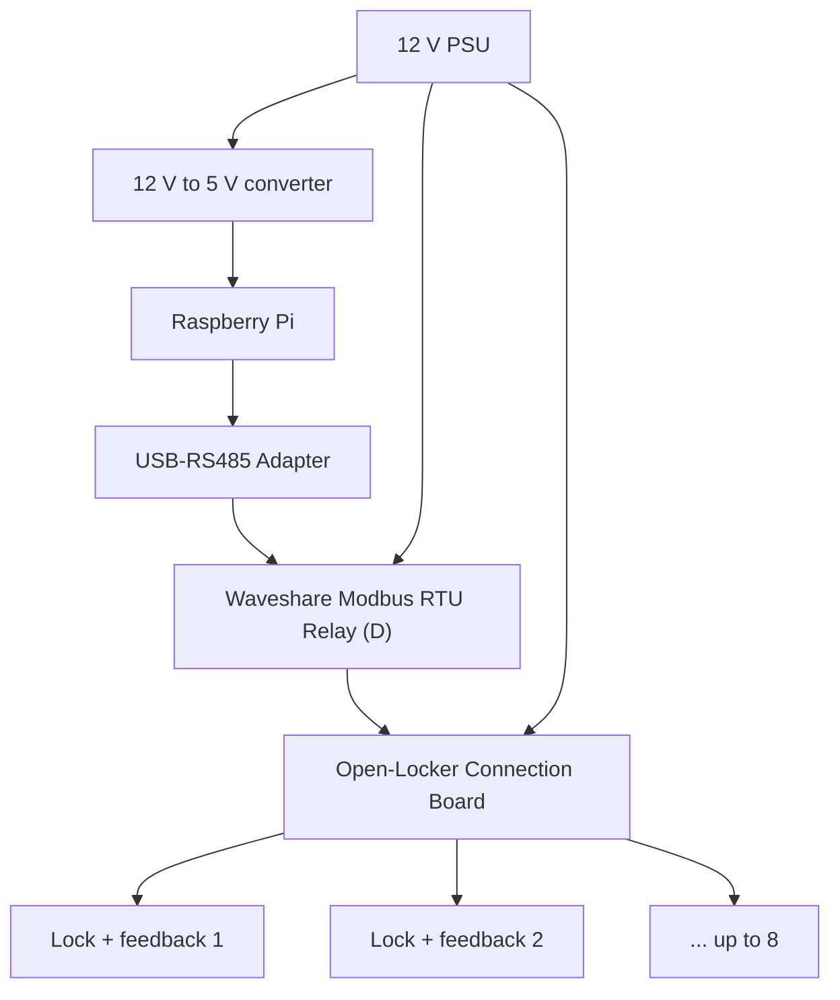

# Open-Locker Hardware Integration Concept

This document explains the current Open-Locker cabinet electronics and drafts a
practical path toward a simpler PCB-based build.

It is written for builders who do not already know PCB design or electronics.
Exact connector pinouts must still be verified against the KiCad schematic,
PCB layout, and the specific lock hardware before manufacturing or wiring a
cabinet.

## Short Answer

Yes, Open-Locker could eventually use one PCB that contains almost everything.
For the current project stage, the better next step is an integrated carrier
PCB: a larger Open-Locker board that holds or connects the proven controller,
relay/input board, lock connectors, power distribution, protection parts, and
RS485 wiring in one clearly labeled place.

Recommended path:

1. Keep active controller and relay electronics on proven off-the-shelf boards.
2. Improve the Open-Locker PCB into a carrier/distribution board around those
   modules.
3. Validate one eight-compartment cabinet.
4. Only consider a fully custom controller PCB after the carrier design is
   stable and repeated builds show that the extra engineering is worth it.

This recommendation is recorded in
[`docs/adr/0018-integrated-carrier-pcb-first.md`](adr/0018-integrated-carrier-pcb-first.md).

## What Exists Today

The validated cabinet-side architecture is:



The repository already contains connection-board KiCad projects under
[`hardware/`](../hardware/). These boards are not full controllers. They are
wiring/distribution boards that make the cabinet easier to connect.

The recommended existing board is:

- [`hardware/connection-board-cut-out_3_5`](../hardware/connection-board-cut-out_3_5)

## Beginner Vocabulary

| Term | Meaning in Open-Locker |
| --- | --- |
| PCB | A printed circuit board. It replaces loose wires with copper tracks and labeled connectors. |
| Carrier PCB | A PCB that organizes other modules instead of replacing all of their electronics. |
| Controller | The computer or microcontroller running the locker client logic. Today this is usually a Raspberry Pi; an ESP board is planned. |
| Relay | An electrically controlled switch. It briefly powers a lock so the door can open. |
| Digital input | A signal read by the board. Open-Locker uses it for door or lock feedback. |
| RS485 | The two-wire electrical bus used for Modbus RTU communication. |
| Modbus RTU | The protocol used between the locker client and the relay/input board. |
| Flyback diode | A protection diode across a lock coil. It absorbs the voltage spike when the lock turns off. |

## Current Eight-Compartment Wiring Model

For each compartment, the logical wiring is:

```text
12 V power
  |
  +--> relay channel contact
          |
          +--> lock release coil
                  |
                  +--> 0 V / GND return

lock feedback switch
  |
  +--> digital input channel
```

Each compartment therefore needs:

- one lock release output path
- one feedback input path
- one flyback diode across the lock coil
- clear labels tying compartment number, relay channel, and digital input
  channel together

The software uses protocol-facing addresses `0..7`, while humans usually talk
about compartments `1..8`. The documentation and PCB silkscreen should show
both where useful, for example `Compartment 1 / Relay 0 / DI 0`.

## Option A: Current Modular Build

This is the safest and most validated option today.



### Benefits

- uses the hardware already supported by the locker-client
- low custom electronics risk
- easy to replace a failed module
- relatively cheap at low quantities
- easier to debug because each module has a clear job

### Drawbacks

- many separate parts
- more hand wiring
- more ways to connect something incorrectly
- harder for a non-electronics builder to reproduce without a wiring guide

## Option B: Integrated Carrier PCB

This is the recommended next hardware design step.

The carrier PCB does not replace the proven relay/input module. Instead, it
turns the inside of the cabinet into a labeled, repeatable assembly.

```text
+-------------------------------------------------------------------+
| Open-Locker Integrated Carrier PCB                                |
|                                                                   |
|  [12 V IN] -> [Fuse] -> [Reverse polarity protection] -> 12 V BUS |
|                                  |                                |
|                                  +--> [12 V to 5 V module]        |
|                                                                   |
|  [Controller area]                                                |
|    - Raspberry Pi + USB-RS485, or                                 |
|    - ESP relay/input board profile                                |
|                                                                   |
|  [RS485 A/B/GND] ---- [Modbus relay/input board connector]        |
|                                                                   |
|  [Compartment 1] [Compartment 2] [Compartment 3] [Compartment 4]  |
|  [Compartment 5] [Compartment 6] [Compartment 7] [Compartment 8]  |
|                                                                   |
|  Each compartment connector:                                      |
|    - lock coil wiring                                             |
|    - feedback switch wiring                                       |
|    - flyback diode                                                |
|    - clear relay/input labels                                     |
+-------------------------------------------------------------------+
```

### What the carrier PCB should include

- 12 V input terminal
- fuse or resettable fuse for cabinet power
- reverse-polarity protection
- 12 V distribution to lock channels
- optional 12 V to 5 V DC-DC converter footprint
- RS485 A/B/GND terminals and daisy-chain/uplink connector
- labeled compartment connectors
- one flyback diode per lock channel
- test pads for 12 V, 5 V, GND, RS485 A, and RS485 B
- mounting holes that match the cabinet and selected modules
- silkscreen labels that explain every connector without needing the schematic

### What should stay off the first carrier PCB

- mains AC power
- custom relay driver electronics
- custom microcontroller circuitry
- battery charging
- undocumented expansion features

Keeping those out makes the first version easier to review, cheaper to
prototype, and safer to debug.

## Option C: Fully Custom All-in-One Controller PCB

A fully custom Open-Locker controller PCB could combine:

- microcontroller or Linux compute module
- Ethernet/Wi-Fi
- RS485
- relay drivers or relay modules
- digital inputs
- power conversion
- protection circuitry
- all lock connectors

This can make sense later, but it is not the best first step.

### Why it is risky now

- Open-Locker would become responsible for more electrical safety decisions.
- Relay and lock current paths require trace-width, heat, and protection
  calculations.
- Firmware, boot recovery, update strategy, and diagnostics become hardware
  design requirements.
- A mistake may require a new PCB revision instead of replacing a purchased
  module.
- Low-volume cost can be higher once engineering time, failed prototypes,
  shipping, and rework are counted.

### When it may become worth it

Revisit a fully custom controller PCB when most of these are true:

- the carrier PCB has been validated in multiple cabinets
- the expected build volume is high enough that module cost matters
- the electrical requirements are stable
- a hardware engineer has reviewed relay, power, EMC, and protection design
- Open-Locker has a manufacturing test plan for every board
- replacement and field-debugging procedures are clear

## Rough Cost Comparison

Prices change quickly, so treat this as directionally useful rather than as a
quote.

| Item | Rough reference | Notes |
| --- | ---: | --- |
| Waveshare `Modbus RTU Relay (D)` | about USD 35 | Official Waveshare single-unit price seen 2026-06-01. |
| Waveshare `ESP32-S3-ETH-8DI-8RO` | about USD 50 | Official Waveshare single-unit price seen 2026-06-01. |
| Simple 2-layer prototype PCB | from about USD 2 / 5 pcs | JLCPCB public prototype headline price for standard small boards; shipping and options are extra. |
| SMT assembly setup | from about USD 8 | JLCPCB public assembly headline price; components, stencil, loading fees, manual soldering, and shipping are extra. |
| Screw terminals, fuses, DC-DC module, connectors | varies | Often more important than bare PCB cost for a wiring board. |

Important interpretation:

- Bare PCBs are cheap.
- Connectors, power parts, assembly, shipping, and mistakes are not free.
- A custom all-in-one board may reduce parts later, but only after design and
  validation costs are spread over enough units.
- For early Open-Locker builds, predefined modules plus a good carrier PCB are
  usually the best cost/risk balance.

## Step-by-Step Path for Open-Locker

### Step 1: Document one known-good cabinet wiring path

Goal: make the current build understandable without opening KiCad first.

Checklist:

- define wire colors for 12 V, GND, RS485 A, RS485 B, lock coil, and feedback
- document each connector on the existing connection board
- map `Compartment 1..8` to relay address `0..7` and digital input `0..7`
- add photos or drawings after the physical build is stable

### Step 2: Validate the existing connection board

Goal: ensure the current board is the correct base for the next design.

Checklist:

- verify every schematic net against a continuity test
- verify every connector label against the actual cabinet harness
- test one lock channel with current-limited 12 V power
- test all eight digital inputs
- test RS485 communication through the board

### Step 3: Design the carrier PCB schematic

Goal: turn the wiring guide into a schematic.

Checklist:

- one repeated channel block per compartment
- one shared power input and protection block
- one controller power block
- one RS485 block
- one relay/input board connection block
- connector labels matching the documentation

### Step 4: Review before ordering

Goal: catch mistakes before money is spent.

Checklist:

- electrical rules check passes in KiCad
- PCB design rules check passes in KiCad
- trace widths are checked for lock current
- relay contacts are rated for the lock load
- 12 V and 5 V rails are clearly separated
- mounting holes and connector clearances match the cabinet
- an electronics-capable reviewer signs off

### Step 5: Order a small bare-PCB prototype

Goal: test the physical design before paying for assembly.

Recommended first order:

- five bare PCBs
- hand-solder through-hole connectors
- populate only the parts needed for one or two channels first

### Step 6: Bench-test safely

Goal: prove the board without risking a full cabinet.

Checklist:

- use a current-limited bench supply if available
- test 12 V polarity protection
- test 5 V output before connecting a controller
- test RS485 communication
- test one relay and one lock
- test one digital input
- repeat for all channels

### Step 7: Cabinet-test one full eight-compartment build

Goal: prove the complete wiring path.

Checklist:

- open every compartment from the backend/mobile flow
- verify each door feedback state
- power-cycle the cabinet and verify relays are safe
- test disconnect/reconnect behavior on RS485
- document any confusing labels or wiring steps

### Step 8: Decide whether a custom controller is justified

Goal: avoid custom electronics until the benefit is clear.

Ask:

- Did the carrier PCB remove most wiring confusion?
- Are failed modules easy to replace?
- Is the module cost now the main cost problem?
- Are there enough repeated builds to justify engineering effort?
- Is there a hardware test plan for production boards?

If the answers are mostly no, keep improving the carrier board and docs.

## Recommended Documentation Map

To make the hardware understandable, keep these docs separate:

- `docs/Bill-of-Materials.md`: what to buy
- `hardware/README.md`: what each PCB project is for
- this document: how the pieces should evolve into a simpler build
- future wiring guide: exact connector pinouts, wire colors, and photos
- ADRs: hardware strategy decisions and why they were made

## Current Recommendation

For Open-Locker now, it is better to have a small, well-documented Open-Locker
PCB plus predefined components that plug into it.

Do not jump straight to a fully custom all-in-one board. The potential future
benefit is real, but the risk and validation effort are too high before the
existing wiring is documented and a carrier PCB has been proven in a cabinet.
