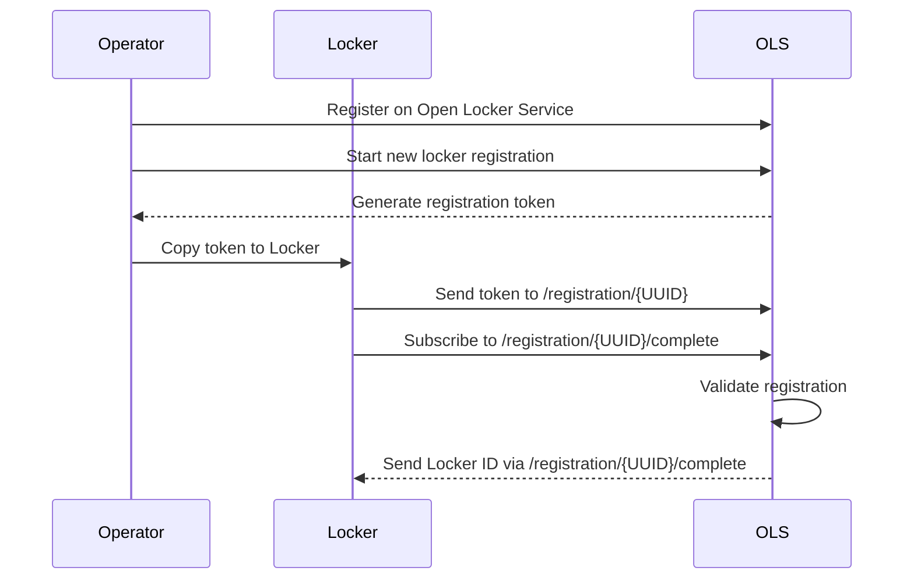

# Locker as a service

The idea is to have a central service so the users do not have to configure it. The locker just connects to the service and receives instructions and reports state.

- [Locker as a service](#locker-as-a-service)
  - [Hosting](#hosting)
  - [Services](#services)
    - [Traeffik Reverse Proxy](#traeffik-reverse-proxy)
    - [Mosquitto](#mosquitto)
    - [Locker Client](#locker-client)
      - [Registration process](#registration-process)
      - [Configuration](#configuration)
      - [Instructions](#instructions)
      - [State publishing](#state-publishing)

## Hosting

We need to setup a domain and book a server. The server needs a docker installation.

* domain https://open-locker.de
* v server
* Manage dns and point *.open-locker.de to the V server

## Services

* Online Locker management
  * Registeration of a locker
  * Removal of a locker
* Locker MQTT Client
  * Open Doors
  * Report state
  * Setup Guide

### Traeffik Reverse Proxy

Setup a traeffik Reverse Proxy for SSL Certificate termination and to have a single entrypoint.

### Mosquitto

Deploy a Mosquitto Mqtt broker used  to communicate with the lockers.

### Locker Client

Docker container used for controlling the locker. Uses MQTT to connect to the locker service and modbus to connect to the locker.

The client setup is done by the operator of the locker

#### Registration process

The operator of the locker needs to be registered on the open locker service. The operator can start the registration of a new locker in the Open Locker Service. This will generate a registration token for the client. The Operator has to copy the token to Locker. The locker sends the token to the `/registration/{UUID}` topic of the Open Locker Service. The Locker then subscribes to a topic named `/registration/{UUID}/complete` where the registration is validated. The message contains the ID of the registered locker generated by the Open Locker Service.

#### Configuration

The Locker subscribes to the topic `/locker/{lockerID}/configuration` to receive configuration changes from the Open Locker Service.

The Configuration is for defining the Modbus addresses of the Locker and which state updates are wanted.

#### Instructions

Instructions like open a door are published via the `locker/{lockerID}/instruction` topic

#### State publishing

The Locker publishes its state via the topic `locker/{lockerID}/instruction`
