# Locker command scenarios

How the backend, the MQTT broker and a locker client talk to each other, as
sequence diagrams: the normal flow first, then every failure we know of. It
describes the code as of 2026-10-16 (backend, app and Pi client as on `main` at
`91275340`, plus the ESP32 firmware), and ends with a checklist of what any new
locker client has to handle.

"Locker client" means whatever runs at the locker bank and drives the lock
hardware: the Raspberry Pi client in `locker-client/` today, the ESP32 firmware
in `locker-firmware/` (#56), or anything built later. The backend cannot tell
them apart, so they must all behave as described here.

The message formats are defined in [`asyncapi/mqtt.yaml`](asyncapi/mqtt.yaml).
This document covers behaviour: order, timing, retries and what happens when a
step fails.

## Contents

- [Participants and identifiers](#participants-and-identifiers)
- [Opening a compartment](#opening-a-compartment)
  - [1. Normal flow](#1-normal-flow)
  - [2. The door does not open](#2-the-door-does-not-open)
  - [3. The client rejects the command](#3-the-client-rejects-the-command)
  - [4. The locker is offline when the command is sent](#4-the-locker-is-offline-when-the-command-is-sent)
  - [5. The response is lost on the way back](#5-the-response-is-lost-on-the-way-back)
  - [6. The broker delivers the command twice](#6-the-broker-delivers-the-command-twice)
  - [7. The backend publishes the command twice](#7-the-backend-publishes-the-command-twice)
  - [8. The client restarts while executing](#8-the-client-restarts-while-executing)
  - [9. The client restarts before claiming the command](#9-the-client-restarts-before-claiming-the-command)
  - [10. The client is shutting down](#10-the-client-is-shutting-down)
  - [11. The door event is lost](#11-the-door-event-is-lost)
- [Other flows](#other-flows)
  - [12. A door opens without a command](#12-a-door-opens-without-a-command)
  - [13. Applying the compartment configuration](#13-applying-the-compartment-configuration)
  - [14. Heartbeat, snapshots and going offline](#14-heartbeat-snapshots-and-going-offline)
  - [15. Provisioning](#15-provisioning)
- [What a locker client must handle](#what-a-locker-client-must-handle)
- [Known gaps](#known-gaps)

## Participants and identifiers

| Participant | What it is |
| --- | --- |
| App | The mobile app. It talks to the backend over HTTPS and Reverb, never MQTT. |
| Backend | Laravel: API, event store, queued reactors on the `events` queue, the MQTT listener (`mqtt:listen`) and the scheduler. |
| Broker | Mosquitto. Every command and response uses QoS 1. |
| Client | The locker client (Pi, ESP32 or other). |
| Hardware | The lock board and door sensors (Modbus or RS485). |

Every command carries two identifiers (ADR-0002):

- **`transaction_id`**: the intent, such as "open compartment 7 once". The
  backend creates it when the user asks and stores it on the
  `CompartmentOpeningRequested` event. It never changes.
- **`message_id`**: one sending of that intent. A new one is created each time
  a message is published, including when the client replays a stored response.

Delivery is **at least once** everywhere: the backend's queue jobs can run
twice, and QoS 1 can deliver a message twice. Nothing is exactly once, so both
ends deduplicate:

| Side | Deduplicates by | Kept for | Code |
| --- | --- | --- | --- |
| Client, inbound commands | `message_id`, then `transaction_id` | 30 days (Pi), newest 256 delivered (ESP32, ADR-0068) | `locker-client/src/adapters/mqtt/inbound-protocol-guard.ts`, `dedup-store.ts` |
| Backend, inbound messages | `message_id` | 24 hours | `locker-backend/app/Mqtt/InboundMqttProtocolGuard.php` |
| Backend, command responses | `(locker, transaction_id)`, first response wins | Permanently | `locker-backend/app/Services/CommandResponseInboxService.php` |

Every client keeps a **command journal** (ADR-0041, ADR-0046, ADR-0068): a
command is *claimed* before the hardware is touched, *completed* with its
response before the response is published, and *delivered* once the broker has
acknowledged the response.

## Opening a compartment

The open request's status in the backend (`CompartmentOpenRequestStatus`):

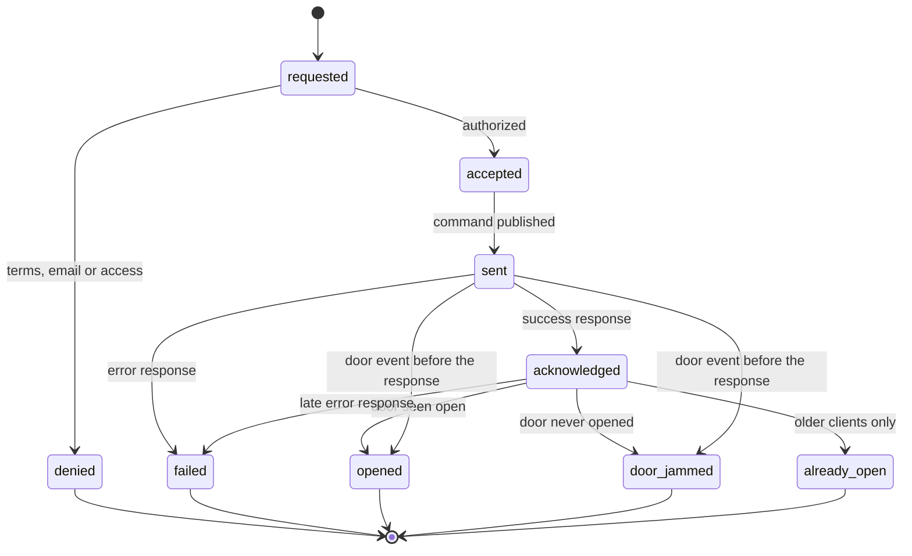
```mermaid
stateDiagram-v2
    [*] --> requested
    requested --> accepted: authorized
    requested --> denied: terms, email or access
    accepted --> sent: command published
    sent --> acknowledged: success response
    sent --> failed: error response
    acknowledged --> opened: door seen open
    acknowledged --> door_jammed: door never opened
    acknowledged --> already_open: older clients only
    acknowledged --> failed: late error response
    sent --> opened: door event before the response
    sent --> door_jammed: door event before the response
    denied --> [*]
    failed --> [*]
    opened --> [*]
    door_jammed --> [*]
    already_open --> [*]
```

The status only moves forward. A late `acknowledged` never overwrites a door
outcome, and a late `failed` never overwrites a door that was seen to move
(`CompartmentOpenRequestProjector`). There is no timeout: a request with no
answer stays at `sent` or `acknowledged` forever.

### 1. Normal flow

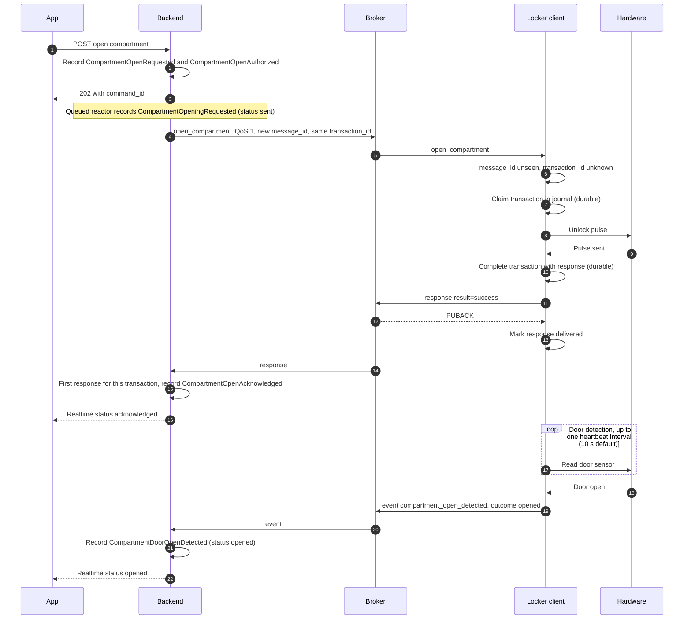
```mermaid
sequenceDiagram
    autonumber
    participant App
    participant BE as Backend
    participant MQ as Broker
    participant LC as Locker client
    participant HW as Hardware

    App->>BE: POST open compartment
    BE->>BE: Record CompartmentOpenRequested and CompartmentOpenAuthorized
    BE-->>App: 202 with command_id
    Note over BE: Queued reactor records CompartmentOpeningRequested (status sent)
    BE->>MQ: open_compartment, QoS 1, new message_id, same transaction_id
    MQ->>LC: open_compartment
    LC->>LC: message_id unseen, transaction_id unknown
    LC->>LC: Claim transaction in journal (durable)
    LC->>HW: Unlock pulse
    HW-->>LC: Pulse sent
    LC->>LC: Complete transaction with response (durable)
    LC->>MQ: response result=success
    MQ-->>LC: PUBACK
    LC->>LC: Mark response delivered
    MQ->>BE: response
    BE->>BE: First response for this transaction, record CompartmentOpenAcknowledged
    BE-->>App: Realtime status acknowledged
    loop Door detection, up to one heartbeat interval (10 s default)
        LC->>HW: Read door sensor
    end
    HW-->>LC: Door open
    LC->>MQ: event compartment_open_detected, outcome opened
    MQ->>BE: event
    BE->>BE: Record CompartmentDoorOpenDetected (status opened)
    BE-->>App: Realtime status opened
```

The success response means "the unlock pulse was sent", not "the door opened"
(ADR-0040). The door outcome comes separately as an event on
`locker/{uuid}/event`. The two are processed by separate queued reactors, so
the backend may see them in either order. The projector handles that.

### 2. The door does not open

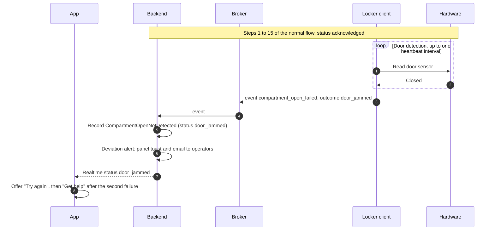
```mermaid
sequenceDiagram
    autonumber
    participant App
    participant BE as Backend
    participant MQ as Broker
    participant LC as Locker client
    participant HW as Hardware

    Note over BE,HW: Steps 1 to 15 of the normal flow, status acknowledged
    loop Door detection, up to one heartbeat interval
        LC->>HW: Read door sensor
        HW-->>LC: Closed
    end
    LC->>MQ: event compartment_open_failed, outcome door_jammed
    MQ->>BE: event
    BE->>BE: Record CompartmentOpenNotDetected (status door_jammed)
    BE->>BE: Deviation alert: panel toast and email to operators
    BE-->>App: Realtime status door_jammed
    App->>App: Offer "Try again", then "Get help" after the second failure
```

"Try again" in the app is a **new** open request with a new `transaction_id`,
not a retry of the old one.

### 3. The client rejects the command

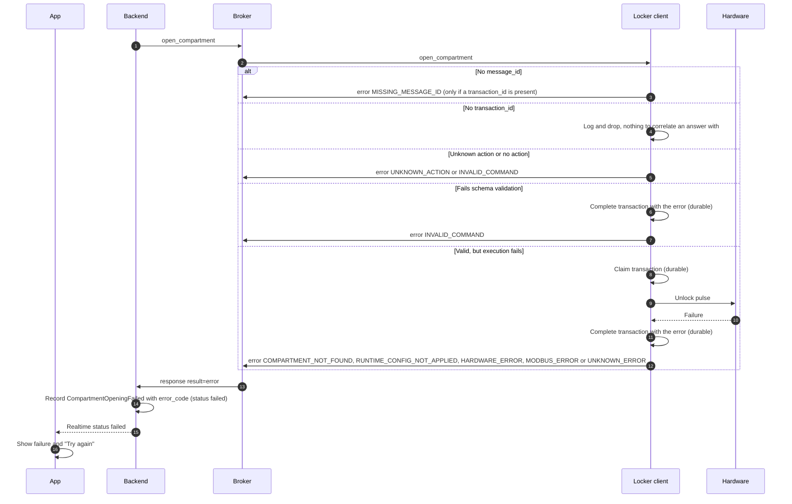
```mermaid
sequenceDiagram
    autonumber
    participant App
    participant BE as Backend
    participant MQ as Broker
    participant LC as Locker client
    participant HW as Hardware

    BE->>MQ: open_compartment
    MQ->>LC: open_compartment
    alt No message_id
        LC->>MQ: error MISSING_MESSAGE_ID (only if a transaction_id is present)
    else No transaction_id
        LC->>LC: Log and drop, nothing to correlate an answer with
    else Unknown action or no action
        LC->>MQ: error UNKNOWN_ACTION or INVALID_COMMAND
    else Fails schema validation
        LC->>LC: Complete transaction with the error (durable)
        LC->>MQ: error INVALID_COMMAND
    else Valid, but execution fails
        LC->>LC: Claim transaction (durable)
        LC->>HW: Unlock pulse
        HW-->>LC: Failure
        LC->>LC: Complete transaction with the error (durable)
        LC->>MQ: error COMPARTMENT_NOT_FOUND, RUNTIME_CONFIG_NOT_APPLIED, HARDWARE_ERROR, MODBUS_ERROR or UNKNOWN_ERROR
    end
    MQ->>BE: response result=error
    BE->>BE: Record CompartmentOpeningFailed with error_code (status failed)
    BE-->>App: Realtime status failed
    App->>App: Show failure and "Try again"
```

Error codes in use (`locker-client/src/domain/errors.ts`): `DOOR_JAMMED`,
`COMPARTMENT_NOT_FOUND`, `RUNTIME_CONFIG_NOT_APPLIED`, `HARDWARE_ERROR`,
`MODBUS_ERROR`, `INVALID_COMMAND`, `UNKNOWN_ACTION`, `MISSING_MESSAGE_ID`,
`SHUTTING_DOWN`, `INVALID_CONFIG`, `TIMEOUT`, `UNKNOWN_ERROR`. The schema does
not list them, and the backend stores whatever string it receives.

### 4. The locker is offline when the command is sent

The backend does not check whether the bank is online before publishing an
open.

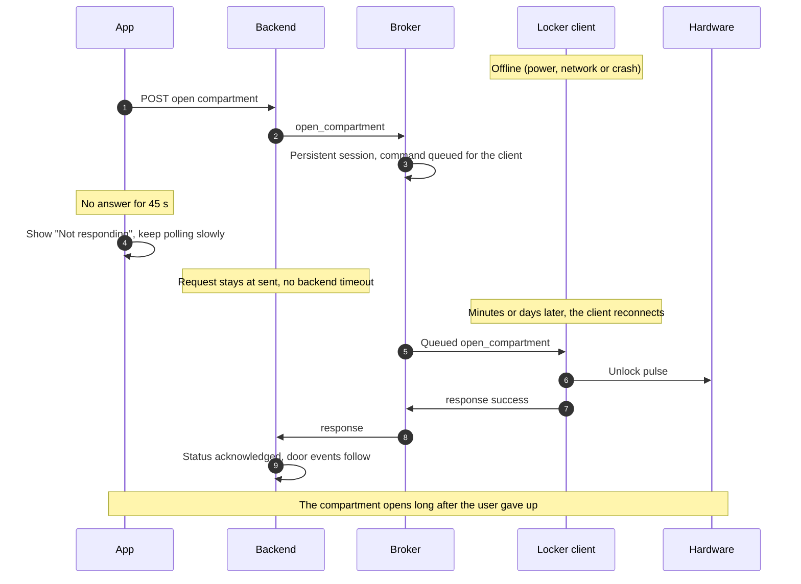
```mermaid
sequenceDiagram
    autonumber
    participant App
    participant BE as Backend
    participant MQ as Broker
    participant LC as Locker client
    participant HW as Hardware

    Note over LC: Offline (power, network or crash)
    App->>BE: POST open compartment
    BE->>MQ: open_compartment
    MQ->>MQ: Persistent session, command queued for the client
    Note over App: No answer for 45 s
    App->>App: Show "Not responding", keep polling slowly
    Note over BE: Request stays at sent, no backend timeout
    Note over LC: Minutes or days later, the client reconnects
    MQ->>LC: Queued open_compartment
    LC->>HW: Unlock pulse
    LC->>MQ: response success
    MQ->>BE: response
    BE->>BE: Status acknowledged, door events follow
    Note over App,HW: The compartment opens long after the user gave up
```

If the user tapped "Try again" in the meantime, that is a second transaction,
queued behind the first, and **both** open the compartment when the client
reconnects. No deduplication can catch this. The command has no deadline the
client could check. Rejecting old commands is discussed in #134.

### 5. The response is lost on the way back

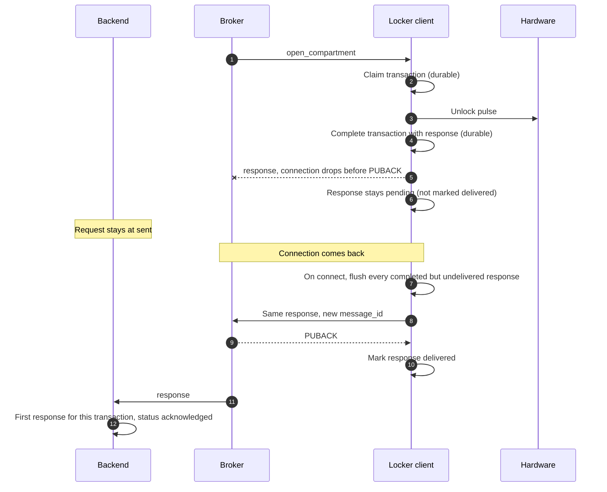
```mermaid
sequenceDiagram
    autonumber
    participant BE as Backend
    participant MQ as Broker
    participant LC as Locker client
    participant HW as Hardware

    MQ->>LC: open_compartment
    LC->>LC: Claim transaction (durable)
    LC->>HW: Unlock pulse
    LC->>LC: Complete transaction with response (durable)
    LC--xMQ: response, connection drops before PUBACK
    LC->>LC: Response stays pending (not marked delivered)
    Note over BE: Request stays at sent
    Note over LC,MQ: Connection comes back
    LC->>LC: On connect, flush every completed but undelivered response
    LC->>MQ: Same response, new message_id
    MQ-->>LC: PUBACK
    LC->>LC: Mark response delivered
    MQ->>BE: response
    BE->>BE: First response for this transaction, status acknowledged
```

If the first copy did reach the backend after all, the second one is ignored
because the transaction already has a response. If the two copies disagree,
the first wins and a warning is logged.

### 6. The broker delivers the command twice

QoS 1 resends a message the client did not acknowledge, after the next
reconnect. The copy has the **same** `message_id`.

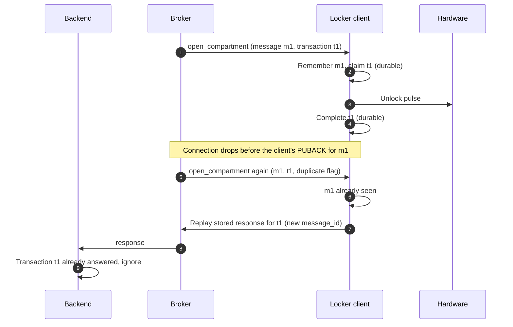
```mermaid
sequenceDiagram
    autonumber
    participant BE as Backend
    participant MQ as Broker
    participant LC as Locker client
    participant HW as Hardware

    MQ->>LC: open_compartment (message m1, transaction t1)
    LC->>LC: Remember m1, claim t1 (durable)
    LC->>HW: Unlock pulse
    LC->>LC: Complete t1 (durable)
    Note over LC,MQ: Connection drops before the client's PUBACK for m1
    MQ->>LC: open_compartment again (m1, t1, duplicate flag)
    LC->>LC: m1 already seen
    LC->>MQ: Replay stored response for t1 (new message_id)
    MQ->>BE: response
    BE->>BE: Transaction t1 already answered, ignore
```

No second unlock. While t1 is still running, a copy produces no answer at all.
The running execution publishes the real one.

### 7. The backend publishes the command twice

The publish runs in a queued job (`MqttReactor`, `--tries=3`). If the worker
dies after the message left but before the job was marked done (deploy,
out-of-memory, timeout), the job runs again. The copy has the same
`transaction_id` and a **new** `message_id`.

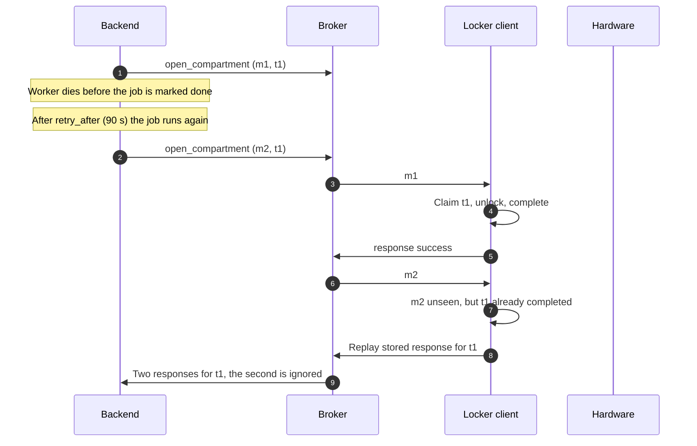
```mermaid
sequenceDiagram
    autonumber
    participant BE as Backend
    participant MQ as Broker
    participant LC as Locker client
    participant HW as Hardware

    BE->>MQ: open_compartment (m1, t1)
    Note over BE: Worker dies before the job is marked done
    Note over BE: After retry_after (90 s) the job runs again
    BE->>MQ: open_compartment (m2, t1)
    MQ->>LC: m1
    LC->>LC: Claim t1, unlock, complete
    LC->>MQ: response success
    MQ->>LC: m2
    LC->>LC: m2 unseen, but t1 already completed
    LC->>MQ: Replay stored response for t1
    MQ->>BE: Two responses for t1, the second is ignored
```

The copies sit next to each other in the broker's queue, so a client that
remembers recent transactions always catches them. An operator running
`php artisan queue:retry` on a failed publish job can republish an old command
much later. That is the only path known today that can outlast the ESP32's
256-transaction memory (ADR-0068).

### 8. The client restarts while executing

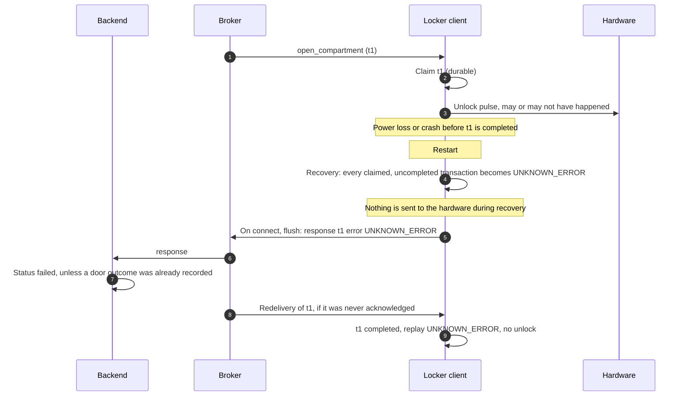
```mermaid
sequenceDiagram
    autonumber
    participant BE as Backend
    participant MQ as Broker
    participant LC as Locker client
    participant HW as Hardware

    MQ->>LC: open_compartment (t1)
    LC->>LC: Claim t1 (durable)
    LC->>HW: Unlock pulse, may or may not have happened
    Note over LC: Power loss or crash before t1 is completed
    Note over LC: Restart
    LC->>LC: Recovery: every claimed, uncompleted transaction becomes UNKNOWN_ERROR
    Note over LC: Nothing is sent to the hardware during recovery
    LC->>MQ: On connect, flush: response t1 error UNKNOWN_ERROR
    MQ->>BE: response
    BE->>BE: Status failed, unless a door outcome was already recorded
    MQ->>LC: Redelivery of t1, if it was never acknowledged
    LC->>LC: t1 completed, replay UNKNOWN_ERROR, no unlock
```

The client cannot know whether the pulse went out, so it never repeats it
(ADR-0041). The user sees a failure and can try again.

### 9. The client restarts before claiming the command

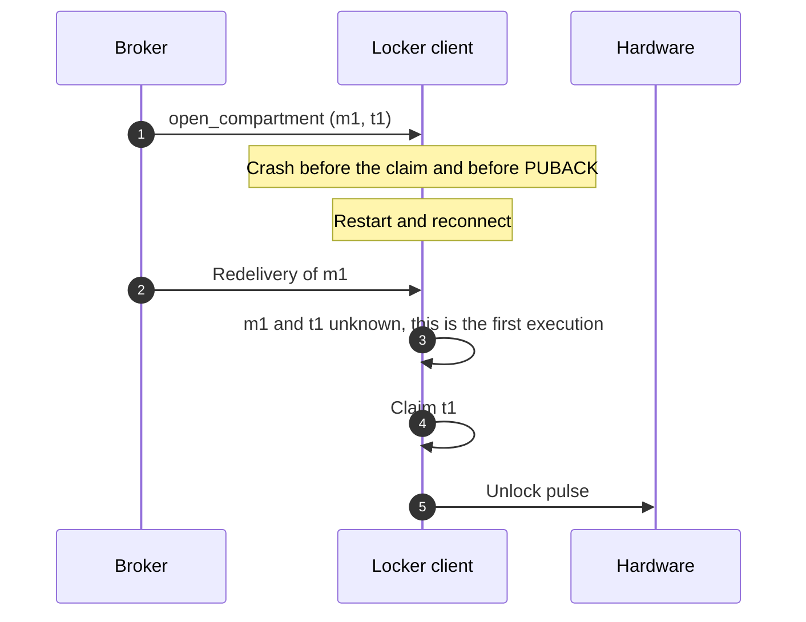
```mermaid
sequenceDiagram
    autonumber
    participant MQ as Broker
    participant LC as Locker client
    participant HW as Hardware

    MQ->>LC: open_compartment (m1, t1)
    Note over LC: Crash before the claim and before PUBACK
    Note over LC: Restart and reconnect
    MQ->>LC: Redelivery of m1
    LC->>LC: m1 and t1 unknown, this is the first execution
    LC->>LC: Claim t1
    LC->>HW: Unlock pulse
```

This is correct: nothing ran before. On the ESP32, esp-mqtt acknowledges the
command as soon as it is queued to the owner task. A crash between that
acknowledgement and the claim **loses** the command instead: no unlock, no
response, and the request stays at `sent`.

### 10. The client is shutting down

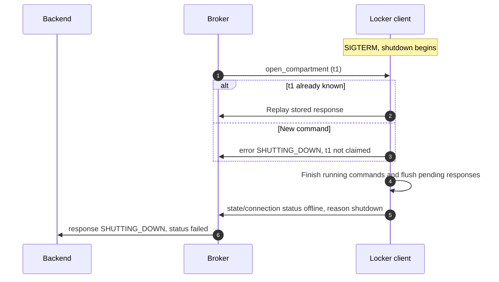
```mermaid
sequenceDiagram
    autonumber
    participant BE as Backend
    participant MQ as Broker
    participant LC as Locker client

    Note over LC: SIGTERM, shutdown begins
    MQ->>LC: open_compartment (t1)
    alt t1 already known
        LC->>MQ: Replay stored response
    else New command
        LC->>MQ: error SHUTTING_DOWN, t1 not claimed
    end
    LC->>LC: Finish running commands and flush pending responses
    LC->>MQ: state/connection status offline, reason shutdown
    MQ->>BE: response SHUTTING_DOWN, status failed
```

### 11. The door event is lost

The response is journalled and retried, but the door event is not.

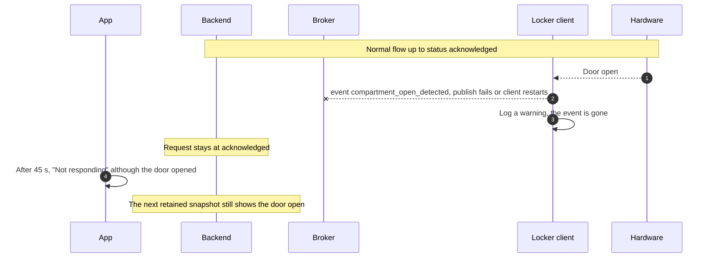
```mermaid
sequenceDiagram
    autonumber
    participant App
    participant BE as Backend
    participant MQ as Broker
    participant LC as Locker client
    participant HW as Hardware

    Note over BE,HW: Normal flow up to status acknowledged
    HW-->>LC: Door open
    LC--xMQ: event compartment_open_detected, publish fails or client restarts
    LC->>LC: Log a warning, the event is gone
    Note over BE: Request stays at acknowledged
    App->>App: After 45 s, "Not responding" although the door opened
    Note over BE: The next retained snapshot still shows the door open
```

The snapshot updates the compartment's door state, but not the open request's
outcome.

## Other flows

### 12. A door opens without a command

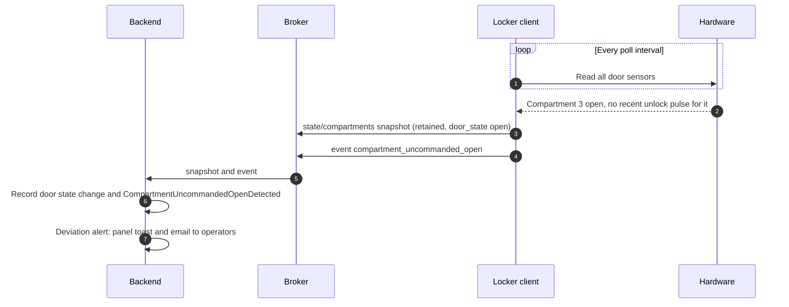
```mermaid
sequenceDiagram
    autonumber
    participant BE as Backend
    participant MQ as Broker
    participant LC as Locker client
    participant HW as Hardware

    loop Every poll interval
        LC->>HW: Read all door sensors
    end
    HW-->>LC: Compartment 3 open, no recent unlock pulse for it
    LC->>MQ: state/compartments snapshot (retained, door_state open)
    LC->>MQ: event compartment_uncommanded_open
    MQ->>BE: snapshot and event
    BE->>BE: Record door state change and CompartmentUncommandedOpenDetected
    BE->>BE: Deviation alert: panel toast and email to operators
```

### 13. Applying the compartment configuration

An operator sends it from the admin panel ("Send config to client"). Nothing
sends it automatically.

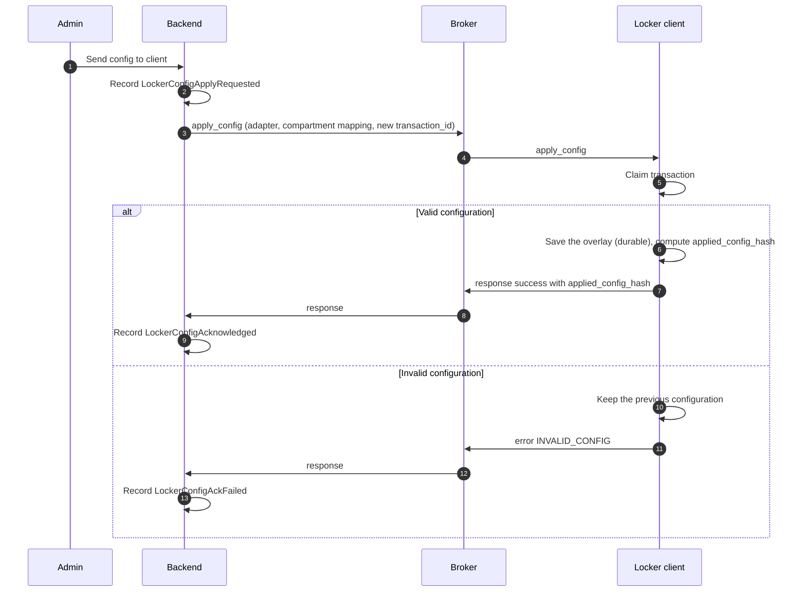
```mermaid
sequenceDiagram
    autonumber
    participant Admin
    participant BE as Backend
    participant MQ as Broker
    participant LC as Locker client

    Admin->>BE: Send config to client
    BE->>BE: Record LockerConfigApplyRequested
    BE->>MQ: apply_config (adapter, compartment mapping, new transaction_id)
    MQ->>LC: apply_config
    LC->>LC: Claim transaction
    alt Valid configuration
        LC->>LC: Save the overlay (durable), compute applied_config_hash
        LC->>MQ: response success with applied_config_hash
        MQ->>BE: response
        BE->>BE: Record LockerConfigAcknowledged
    else Invalid configuration
        LC->>LC: Keep the previous configuration
        LC->>MQ: error INVALID_CONFIG
        MQ->>BE: response
        BE->>BE: Record LockerConfigAckFailed
    end
```

Until a configuration has been applied, every open fails with
`RUNTIME_CONFIG_NOT_APPLIED`. `apply_config` uses the same journal and
deduplication as opens, so a duplicate replays the stored answer.

### 14. Heartbeat, snapshots and going offline

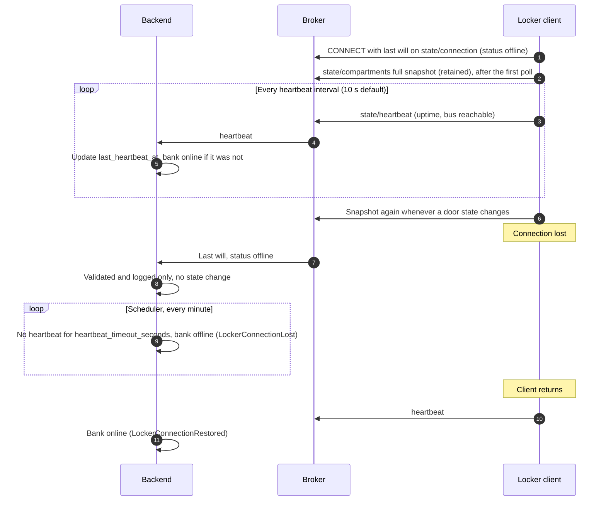
```mermaid
sequenceDiagram
    autonumber
    participant BE as Backend
    participant MQ as Broker
    participant LC as Locker client

    LC->>MQ: CONNECT with last will on state/connection (status offline)
    LC->>MQ: state/compartments full snapshot (retained), after the first poll
    loop Every heartbeat interval (10 s default)
        LC->>MQ: state/heartbeat (uptime, bus reachable)
        MQ->>BE: heartbeat
        BE->>BE: Update last_heartbeat_at, bank online if it was not
    end
    LC->>MQ: Snapshot again whenever a door state changes
    Note over LC: Connection lost
    MQ->>BE: Last will, status offline
    BE->>BE: Validated and logged only, no state change
    loop Scheduler, every minute
        BE->>BE: No heartbeat for heartbeat_timeout_seconds, bank offline (LockerConnectionLost)
    end
    Note over LC: Client returns
    LC->>MQ: heartbeat
    BE->>BE: Bank online (LockerConnectionRestored)
```

The heartbeat timeout is the only thing that marks a bank offline. The last
will is received but not used yet.

### 15. Provisioning

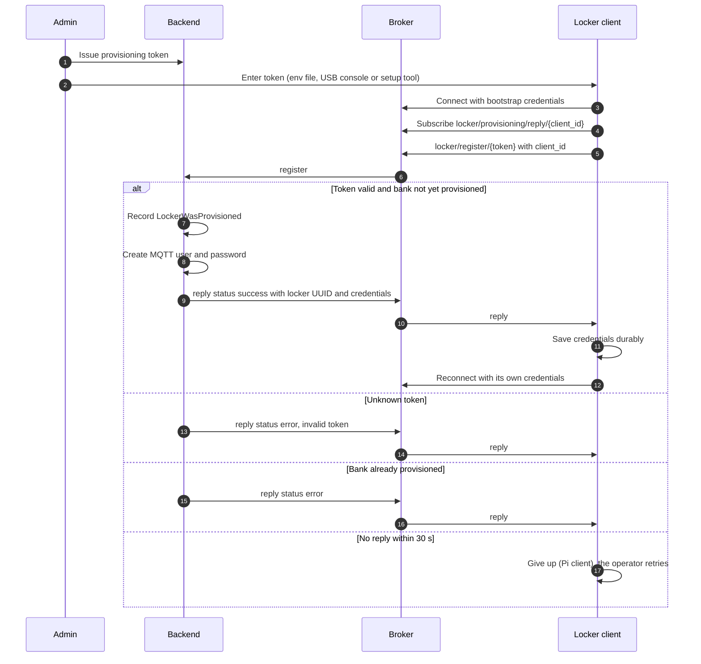
```mermaid
sequenceDiagram
    autonumber
    participant Admin
    participant BE as Backend
    participant MQ as Broker
    participant LC as Locker client

    Admin->>BE: Issue provisioning token
    Admin->>LC: Enter token (env file, USB console or setup tool)
    LC->>MQ: Connect with bootstrap credentials
    LC->>MQ: Subscribe locker/provisioning/reply/{client_id}
    LC->>MQ: locker/register/{token} with client_id
    MQ->>BE: register
    alt Token valid and bank not yet provisioned
        BE->>BE: Record LockerWasProvisioned
        BE->>BE: Create MQTT user and password
        BE->>MQ: reply status success with locker UUID and credentials
        MQ->>LC: reply
        LC->>LC: Save credentials durably
        LC->>MQ: Reconnect with its own credentials
    else Unknown token
        BE->>MQ: reply status error, invalid token
        MQ->>LC: reply
    else Bank already provisioned
        BE->>MQ: reply status error
        MQ->>LC: reply
    else No reply within 30 s
        LC->>LC: Give up (Pi client), the operator retries
    end
```

The token is single use. If the reply is lost after the backend accepted it,
the bank is provisioned but the client has no credentials, and the operator
has to issue a new token.

## What a locker client must handle

Each item points to the scenario that needs it. A new client is complete when
it handles all of them.

**Commands**

- [ ] Process one command at a time, so no two commands interleave.
- [ ] Reject a command without `message_id` (`MISSING_MESSAGE_ID`), and drop one without `transaction_id` silently. (3)
- [ ] Answer an unknown or missing action with `UNKNOWN_ACTION` or `INVALID_COMMAND`, and an invalid payload with `INVALID_COMMAND`. (3)
- [ ] Remember every `message_id` and ignore a repeat, replaying the stored response if there is one. (6)
- [ ] Look up the `transaction_id`: completed means replay the stored response, in progress means stay silent, unknown means run it. (6, 7)
- [ ] Claim the transaction durably **before** touching the hardware, in the same step as the lookup. (1, 8)
- [ ] Store the response durably **before** publishing it. (1, 5)
- [ ] Mark the response delivered only after the broker acknowledged it, and publish every undelivered response again on each connect. (5)
- [ ] On start, answer every claimed but uncompleted transaction with `UNKNOWN_ERROR`, and never repeat its pulse. (8)
- [ ] Send nothing to the hardware during start or recovery. (8)
- [ ] While shutting down, replay known transactions but refuse new ones with `SHUTTING_DOWN`, without claiming them. (10)
- [ ] Refuse opens until a configuration is applied (`RUNTIME_CONFIG_NOT_APPLIED`). (13)

**Opening**

- [ ] Answer `success` as soon as the unlock pulse is sent, not when the door opens. (1)
- [ ] Never retry an unlock pulse on its own. (3, 8)
- [ ] Watch the door for one heartbeat interval and publish `compartment_open_detected` or `compartment_open_failed`. (1, 2)
- [ ] Report a door that opens with no recent pulse as `compartment_uncommanded_open`. (12)

**State and liveness**

- [ ] Connect with a persistent session and a last will on `state/connection`. (4, 14)
- [ ] Publish a non-retained heartbeat every interval, with the bus status. (14)
- [ ] Publish a retained full snapshot after the first poll and on every door state change, using `unknown` for a door that cannot be read. (14)
- [ ] Publish `state/connection` offline with reason `shutdown` when stopping cleanly. (10)

**Configuration and provisioning**

- [ ] Validate `apply_config` completely, keep the old configuration on error, and store the new one durably before answering with its hash. (13)
- [ ] Provision with the single-use token and save the issued credentials durably. The token is spent once the backend accepts it. (15)

## Known gaps

What the system does not handle today. A new client cannot fix these alone.

- **No deadline on commands.** A command for an offline locker stays valid
  forever and opens the compartment whenever it arrives, including after the
  user gave up or tried again (scenario 4). Discussed in #134.
- **No backend timeout.** A request with no answer stays at `sent` or
  `acknowledged` forever. Only the app stops waiting, after 45 s.
- **Opens are not refused for offline banks.** The backend publishes without
  checking `connection_status`.
- **Door events are not retried.** A lost door event leaves the request at
  `acknowledged` (scenario 11).
- **The last will is ignored.** Offline detection waits for the heartbeat
  timeout (scenario 14).
- **Manual `queue:retry` can republish old commands** (scenario 7).
- **Error codes are not part of the schema.** Clients and backend agree on
  them only by convention (scenario 3).
- **Lost provisioning replies need a new token** (scenario 15).

## References

- Contract: [`asyncapi/mqtt.yaml`](asyncapi/mqtt.yaml)
- ADR-0002 (message ID and transaction ID), ADR-0040 (acknowledgement vs door
  detection), ADR-0041 (response recovery), ADR-0046 (client persistence),
  ADR-0048 (one-time provisioning),
  [ADR-0068](adr/0068-esp32-command-journal-record-format-and-retention.md)
  (ESP32 journal)
- Backend: `app/Reactors/MqttReactor.php`, `app/Mqtt/Handlers/`,
  `app/Services/CommandResponseInboxService.php`,
  `app/Reactors/CommandResponseReactor.php`, `app/Reactors/DoorDetectionReactor.php`,
  `app/Projectors/CompartmentOpenRequestProjector.php`,
  `app/Console/Commands/DetectOfflineLockers.php`
- Pi client: `src/adapters/mqtt/command-dispatcher.ts`,
  `src/adapters/mqtt/dedup-store.ts`, `src/application/open-compartment.ts`,
  `src/bootstrap/createApp.ts`
- App: `src/features/compartmentOpen/openProgress.ts`
