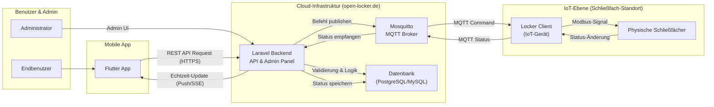

# MQTT-basierte Architektur

Dies ist eine Visualisierung der neuen, auf MQTT basierenden Systemarchitektur.

```mermaid
graph LR
    subgraph "Benutzer & Admin"
        User["Endbenutzer"]
        Admin["Administrator"]
    end

    subgraph "Mobile App"
        MobileApp["Flutter App"]
    end

    subgraph "Cloud-Infrastruktur (open-locker.de)"
        LaravelBackend["Laravel Backend<br/>API & Admin Panel"]
        Mosquitto["Mosquitto<br/>MQTT Broker"]
        Database["Datenbank<br/>(PostgreSQL/MySQL)"]
    end

    subgraph "IoT-Ebene (Schließfach-Standort)"
        LockerClient["Locker Client<br/>(IoT-Gerät)"]
        PhysicalLockers["Physische Schließfächer"]
    end

    %% User Flows
    User --> MobileApp
    Admin -- "Admin UI" --> LaravelBackend

    %% API Flow (Command)
    MobileApp -- "REST API Request (HTTPS)" --> LaravelBackend
    LaravelBackend -- "Validierung & Logik" --> Database
    LaravelBackend -- "Befehl publishen" --> Mosquitto
    Mosquitto -- "MQTT Command" --> LockerClient
    LockerClient -- "Modbus-Signal" --> PhysicalLockers

    %% Status Flow (Feedback)
    PhysicalLockers -- "Status-Änderung" --> LockerClient
    LockerClient -- "MQTT Status" --> Mosquitto
    Mosquitto -- "Status empfangen" --> LaravelBackend
    LaravelBackend -- "Status speichern" --> Database
    LaravelBackend -- "Echtzeit-Update (Push/SSE)" --> MobileApp
```
