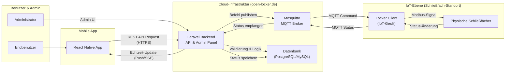

# MQTT-basierte Architektur

Dies ist eine Visualisierung der neuen, auf MQTT basierenden Systemarchitektur.

## Health des MQTT-Listeners

Der `mqtt-listener`-Container (`php artisan mqtt:listen`) meldet seine Liveness
über einen Heartbeat (siehe ADR-0025):

- Der Listener schreibt bei jeder Loop-Iteration einen Heartbeat-Zeitstempel in
  den Cache (gedrosselt auf `MQTT_LISTENER_HEARTBEAT_INTERVAL`, Standard 10s).
- `php artisan mqtt:health` ist der `healthcheck` des Containers: Exit `0`
  (healthy), wenn der Heartbeat jünger als `MQTT_LISTENER_HEARTBEAT_MAX_AGE`
  (Standard 35s) ist, sonst Exit `1` (unhealthy).

Status-Interpretation:

- **healthy** — die Listener-Loop läuft (bleibt auch healthy, während der Broker
  kurz offline ist / reconnectet, da der Puls die Loop misst, nicht den
  Nachrichtenfluss).
- **unhealthy** — kein frischer Puls: Prozess hängt/wedged oder Cache nicht
  erreichbar. Der `autoheal`-Sidecar startet jeden `unhealthy` Container mit dem
  Label `autoheal: "true"` neu (Plain Compose startet bei Health-Status nicht
  von selbst neu).

Hinweis: `autoheal` startet über die Docker-`restart`-API neu, daher erhöht sich
`RestartCount` **nicht** — Restarts in den `autoheal`-Logs bzw. an `StartedAt`
prüfen.
